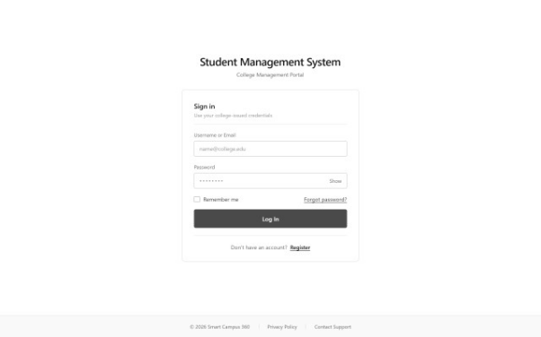

# Login Wireframe

## Overview

The Login page provides secure access to the Smart Campus 360 Student Management System.

It allows students and administrators to authenticate before accessing the application.

---

## Wireframe

---

## Page Components

### Header

| Component | Description |
|-----------|-------------|
| System Title | Student Management System |
| Subtitle | College Management Portal |

---

### Login Form

| Component | Type | Required |
|-----------|------|----------|
| Username or Email | Text | Yes |
| Password | Password | Yes |
| Show Password | Toggle | No |
| Remember Me | Checkbox | No |
| Forgot Password | Link | No |
| Login | Button | Yes |

---

### Footer

- Privacy Policy
- Contact Support
- Copyright © 2026 Smart Campus 360

---

## Validation Rules

- Username/Email is required.
- Password is required.
- Invalid credentials display an error message.
- Password remains masked unless Show Password is selected.

---

## Navigation

Successful Login

→ Dashboard

Register Link

→ Student Registration Page

Forgot Password

→ Password Reset Page

---

## Notes

- Designed using Salesforce Lightning Design principles.
- Low-fidelity grayscale wireframe.
- Desktop layout.