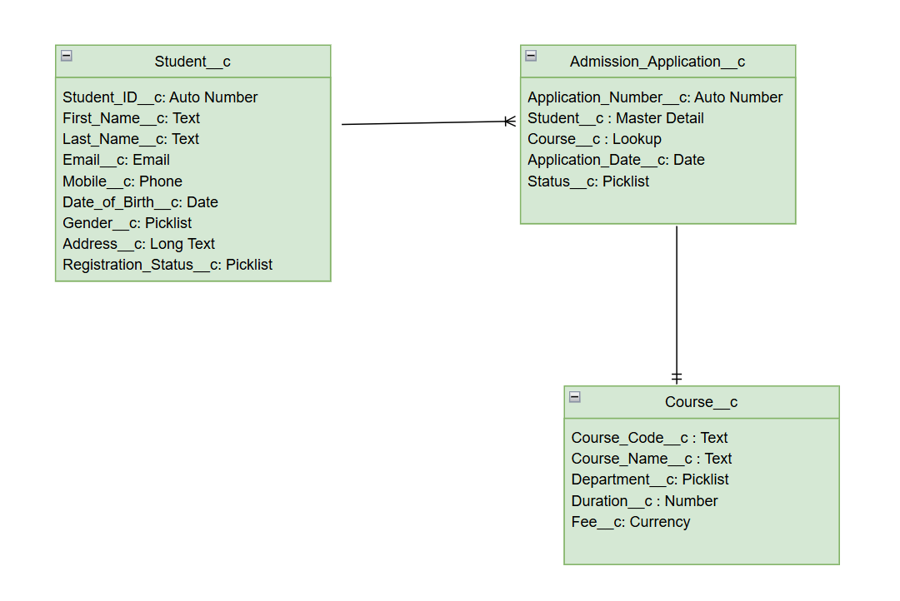

# Object Model
## Entity Relationship Diagram

---

## Student__c

Stores student personal information.

### Fields

| Field | Type |
|-------|------|
| Student_ID__c | Auto Number |
| First_Name__c | Text |
| Last_Name__c | Text |
| Email__c | Email |
| Mobile__c | Phone |
| Date_of_Birth__c | Date |
| Gender__c | Picklist |
| Address__c | Long Text |
| Registration_Status__c | Picklist |

---

## Admission_Application__c

Stores admission applications.

### Fields

| Field | Type |
|-------|------|
| Application_Number__c | Auto Number |
| Student__c | Master Detail |
| Course__c | Lookup |
| Application_Date__c | Date |
| Status__c | Picklist |

---

## Course__c

Stores available courses.

### Fields

| Field | Type |
|-------|------|
| Course_Code__c | Text |
| Course_Name__c | Text |
| Department__c | Picklist |
| Duration__c | Number |
| Fee__c | Currency |