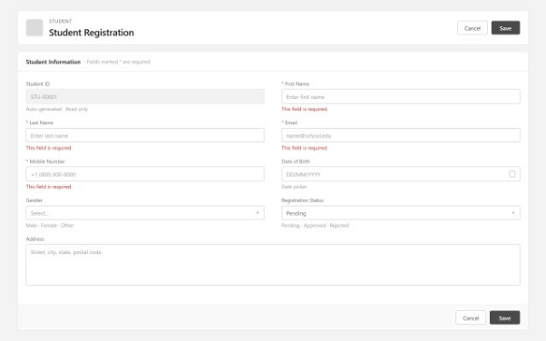

# Student Registration Wireframe

## Overview

The Student Registration page allows administrators or students to register a new student in the Smart Campus 360 system.

The page captures all required personal information before creating a Student record.

---

## Wireframe



---

## Page Components

### Header

| Component | Description |
|-----------|-------------|
| Page Title | Student Registration |
| Save | Saves the record |
| Cancel | Returns without saving |

---

## Student Information

| Field | Type | Required |
|------|------|----------|
| Student ID | Auto Number (Read Only) | No |
| First Name | Text | Yes |
| Last Name | Text | Yes |
| Email | Email | Yes |
| Mobile Number | Phone | Yes |
| Date of Birth | Date | No |
| Gender | Picklist | No |
| Registration Status | Picklist | No |
| Address | Long Text Area | No |

---

## Validation

Required Fields

- First Name
- Last Name
- Email
- Mobile Number

Validation message

```
This field is required.
```

---

## Buttons

| Button | Action |
|---------|--------|
| Save | Creates Student Record |
| Cancel | Discards changes |

---

## Business Rules

- Student ID is automatically generated.
- Registration Status defaults to **Pending**.
- Email must be in a valid email format.
- Mobile Number accepts only valid phone numbers.

---

## Notes

- Designed using Salesforce Lightning Design principles.
- Low-fidelity grayscale wireframe.
- Desktop layout.
- Two-column responsive form.